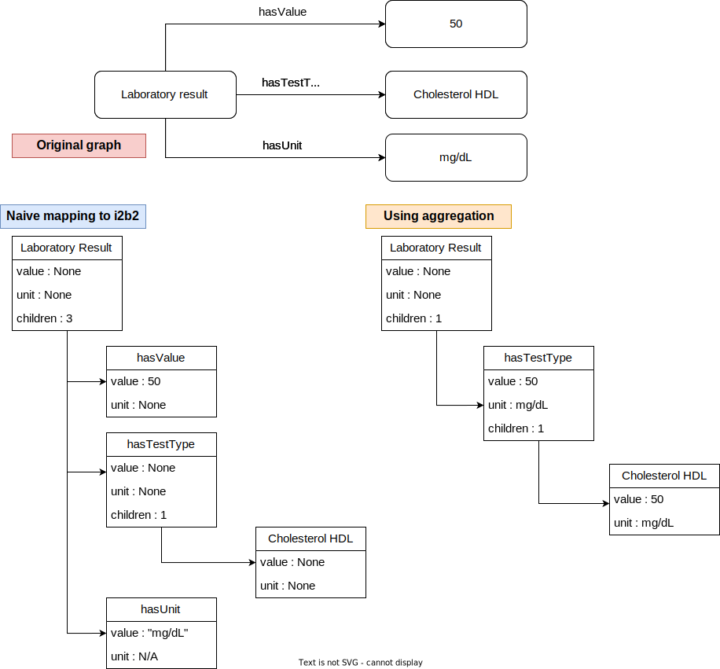
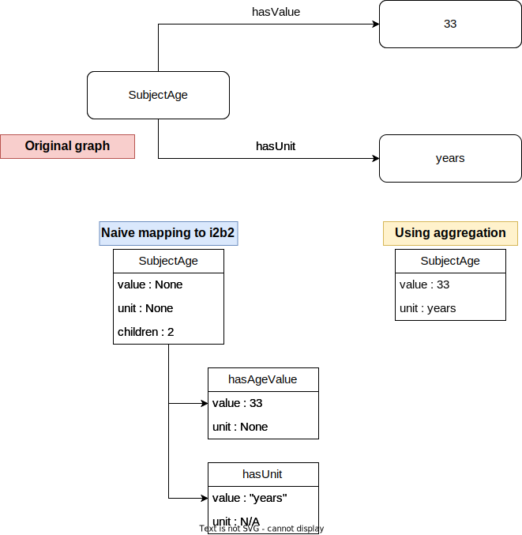

.. _configuration:

Organization of the config files
================================

graph_config.json
-----------------------
This configuration file helps piloting the RDF graphs parsing and discovery. It is used by both the ontology converter and the data converter. It defines the RDF terms to be expected in the graph, the reserved URIs, etc. It also features a lookup table for terminology RDF graphs, so they can be loaded by the ontology converter in a distinct memory slot as the main ontology graph, speeding up the computations.
The fields are as follow:

.. csv-table:: Field description of graph_config
        :file: _tables/graph_config_doc.csv

data_config.json
-----------------------
This file is only used by the data converter.
It therefore specifies a data-specific blacklist, the path to the data and dependencies graphs, and describes the mappings for RDF contextual fields that are not featured in the i2b2 ontology.
It contains structured instructions about how these fields should be unpacked and mapped to specific table and columns of the i2b2 star schema.

.. csv-table:: Field description of graph_config
        :file: _tables/data_config_doc.csv

i2b2_rdf_config.json
----------------------
This file describes the bindings between RDF datatypes and i2b2 table-columns, and defines additional filters for ontology elements that should or should not appear in the final ontology.

.. csv-table:: Field description of i2b2_rdf_config
        :file: _tables/i2b2_config_doc.csv

Explanation of the migrate-reduce option
~~~~~~~~~~~~~~~~~~~~~~~~~~~~~~~~~~~~~~~~~

Use example:

.. code-block:: JSON
        
        {
        "MIGRATIONS": { 
            "myprefix:LabTestValue":{
                "concept": "myprefix:LabResult",
                "destination": [
                "myprefix:hasLabResultLabTestCode/\*"
                ],
                "xmlvaluetype": "Float"
                }
        }
        }
                

.. admonition:: Ontology items fine-grained relocation
        
        The most complex item of this configuration file is the list of instructions for *element migration/aggregation*. It is useful when an ontology item *A* should be moved to another location in the ontology tree, or which properties should be merged into one or more other items *B_i*. For example, one could want an *SubjectAge* concept to be flagged as a numeric item, but following strictly the RDF input would maybe lead to the *SubjectAge* concept having a child element *AgeValue* flagged as a numeric item. In this case, one would fill in the instructions for migrating *AgeValue* into *SubjectAge*. For a laboratory result, one could want the laboratory test codes to carry the numeric value instead of having a distinct *LabResultValue* element, which makes sense in RDF but not in i2b2 (a single item can carry more information). 
        
     The same kind of manipulation is done by default on the *datetime* and *units* elements, since i2b2 allows an ontology item to carry both its identifier, a date, a value and a unit if necessary. We use a naive approach for the *datetime* and *unit*, applying them to the direct parent (which will then make it trickle down to its other children). Such an approach doesn't make sense for numerical values, hence the present instructions to configure aggregations. 

Example of reduction:

   While the RDF graph features 1-dimensional objects, i2b2 can deal with more complex objects. Automatic aggregation of several RDF properties into a single i2b2 element is limited. The top element shows the original RDF graph, the left element shows the output of a naive conversion and the right element shows the result of a better reduction, making full use of the 'unit' and 'value' fields of i2b2 items. 

Another example of reduction:

   The aggregation-migration system can also allow you to reduce unnecessarily complex hierarchies into a parent element.
