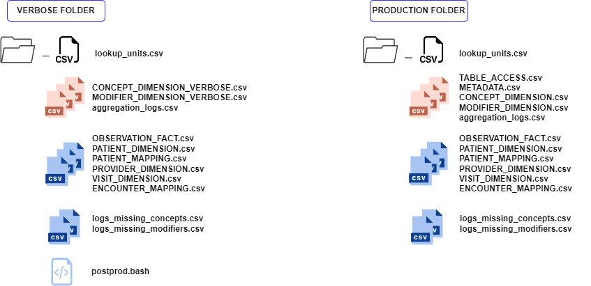

.. _structure:

Organization of the I/O files and folders
==================================================
*General information:*

Input graphs: **Do NOT put any data graph in the ONTOLOGY folder, and do NOT put ontology graphs in the DATA folder.** This would break the very logic of the converter, which expects a clear partition.

Output folders: The preferred approach is to have two folders, one which will be used as output for the verbose mode, and one for the production mode.
The input (RDF graph) files should all be descendants of a unique folder. The converter will load incrementally in a single graph all .ttl files found below the starting point (exploring recursively the subfolders and following symlinks). Thus, you should remove the undesired graphs or zip them.

ONTOLOGY CONVERSION INPUT
--------------------------
The reading of input RDF graphs (default is *turtle* format, configurable) happens recursively from the specified folders (see configuration files). If using a Docker container, take into account the volume bound to your host $(ONTOLOGY) should not contain RDF graphs but rather a *main_ontologies* folder containing RDF graphs (which can be in subfolders, this part is more flexible)

**Folder names are configurable in** *graph_config.json*. (See :ref:`Configuration <configuration>`)

Using external terminologies
~~~~~~~~~~~~~~~~~~~~~~~~~~~~
Asidet to the *main_ontologies* folder, you can specify a *terminology* folder containing extra graphs such as external terminologies. You can also put them directly in your *main_ontologies* hierarchy but having them separate will improve the graph parsing resource usage. 

.. important:: 
   
   **Do NOT put any data graph in the ONTOLOGY folder, and do NOT put ontology graphs in the DATA folder.** This would break the very logic of the converter, which expects a clear partition.

.. figure:: _images/ontologygraphs_folder.drawio.svg
   :class: with-shadow
    
   All RDF graphs under the *$(ONTOLOGY)/main_ontologies* will be parsed and converted into the output i2b2 ontology. The *external_terminologies* folder should be used for storing large terminologies that are complementary to the main ontology graph.

DATA CONVERSION INPUT
------------------------
All RDF graphs under the specified folder are parsed and converted to i2b2 data records. It is possible to add an entrypoint to a terminology files for units ; it will be parsed with the data graphs.

.. figure:: _images/datagraphs_folder.drawio.svg
   :class: with-shadow
    
   Data graphs and unit graphs will be loaded together, the folder distinction is only for clarity. The only important thing is that no ontology graph should be present in either hierarchy.

Batch conversion for large (>4GB) datasets 
~~~~~~~~~~~~~~~~~~~~~~~~~~~~~~~~~~~~~~~~~~
Due to the overhead of the ``rdflib`` Python library, it is likely that a 32-GB RAM gets overloaded when trying to convert more than ~4GB of data samples at once.
We offer a divide-and-conquer shell script that takes **patient-based** partitions of the datasets and repeatedly triggers data conversions run on each batch before merging all the outputs together. Please refer to the in-file comments of the *converter-merger.sh* script present in the `data converter Docker repository <https://github.com/CHUV-DS/docker-data-converter>`_

OUTPUT TABLES
----------------
The data converter optionally reads ontology tables for QA. For this (recommended) sanity check to be automatically performed, the converted ontology tables (in fact, only *CONCEPT_DIMENSION* and *MODIFIER_DIMENSION*) need to be present in the data converter destination folder. Details about this procedure and why we have two lookalike output folders are explained in the :ref:`Verbose tables page <verbose>`.

   
   Composition of the output folders for both converters. Black icons figure files that will be taken into account by the ontology converter if present **BEFORE** the run ; Red icons are outputs of the ontology converter andcan be used for quality assessment after data conversion ;  Blue icons are outputs of the data converter.

   
        
.. Admonition:: Loading into i2b2

   All the CSV files of the **PRODUCTION** folder with upper-case names should be loaded into the i2b2 database.
               
